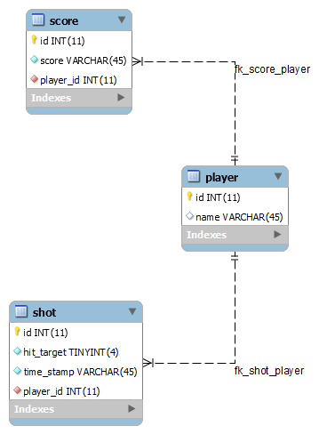

# Learning journal

Your learning journal can be seen as a diary of your learning process. It is a place where you can reflect on your learning, and where you can keep track of your progress. It is also a place where you can keep track of your questions, and where you can write down your answers to those questions.

So for example when you receive feedback on your project, you can write down the feedback and your reflection on it in your learning journal. You can also write down what you have learned from the feedback, and how you will apply it in your project.

## Week 1

Monday I was unfortunately not able to attend the lesson. In my own time I spent some time looking through all the online files about the lectures I also asked a few fellow students about the information i missed. 

I started the course setting up all seperate parts of the project and seeing if they would run. I installed all necessary programs and setup the template project. After this I started working on an ERD for a Database design.

  

### Feedback
**🌐 Database**

**Reviewer: Nick Schokker**

**Feedback: looks good but in the highscore field you should add the player because you would like to know who has the highest score.**

Although I ended up not using this feedback as I instead completely removed the highscore table as it was redundant due to the existence of a score table that could just be sorted.

### Feedback
**🌐 Database**

**Reviewer: Mats Otten**

I have not received feedback for this as of this moment.

### EER Diagram
After making my first draft of ERD I started designing the Database itself to show this I've made an EER Diagram.

  

### PHP Learning
I spent some time learning the basics of PHP and setting up some basic scripts. I followed this [tutorial](https://www.youtube.com/watch?v=OK_JCtrrv-c&ab_channel=freeCodeCamp.org). I was able to skip a big portion of it as it went over a lot of programming basics.

### Setting up platform.io project
For my embedded part I decided to not use the Arduino IDE and instead choose platform.io as this was more familiar for me. This also allows me to easily create multiple files and work in a more OOP fashion. Another benefit is that platform.io is an extension in vscode allowing me to work in vscode for all parts of the project.

### Documentation
This week I also worked on some documentation. I wrote documentation for my database and embedded requirements.

## Week 2
