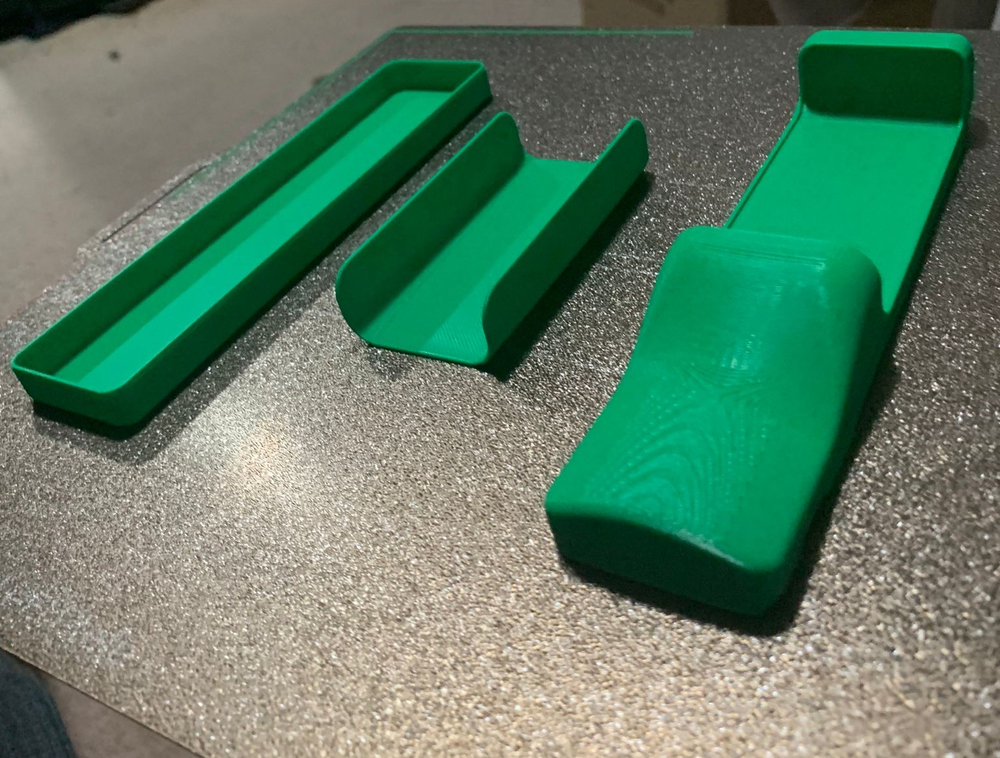
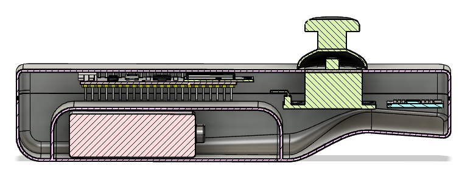

# Concept & Design

# 2. Demographic
The demographic of people using this system would be an all ages demographic from retro game enjoyers of old to young kids. The system must be easy to use and most importantly fun. This will influence some design decisions such as the controller. The gun can't look too violent and shouldn't look like a traditional gun. Also the handle can't be too large to allow all types of people to be able to comfortably hold the controller.

# 3. Concept
The concept for my project is to make a game similair to Duck Hunt. Where the player will be provided a controller and a display. Instead of using the traditional way I will be trying to put my own spin on it. The traditional way is by using an optical sensor in the gun/controller that when pressed will see if it is pointing at a portion of the screen that's white. Also the moment the controller is pressed the whole screen goes black except for the target/duck. The moment the screen flickers and the sensor sees a white spot on the screen it has hit a duck. 

  
  

I wanted to put my own spin on it. The controller will have a gyroscope in it allowing it to serve as a motion controller. Similair to the Wii but not exactly as the wii uses a different technique. I wish to emulate the easy of use of the Wii controller but using a different technique.

Additionally the controller will be wireless and communicate with the display through a bluetooth connection. This will allow the controller to tell the display where to move the cursor.

# 4. Product requirements
- The game console must be set up by users in under 15 minutes, with clear instructions provided.
- The controller's design should be non-violent and appealing to users of all ages.
- The wireless controller should be easy to hold for both children and adults, with a comfortable design.
- The controller must maintain a stable Bluetooth connection to the display within a 10-meter range.

## Controller concepts
The controller is one of the most important elements of this entire projects. Having a solid concept is essential for the project to feel complete.
Below some concepts can be seen.

  

  

An additional idea is to allow the controller to be plugged into an attachment to give it more of a gun feel. This allows the controller to be more multi purpose incase of additional games, but still allow it to be fitting for the main game being worked on.

  

 

## Design

### The first prototype
This model was mostly to get a feeling of the size of the controller to see if everything would fit the way I expted from inspecting it in the CAD.

  

  

Some adjustments that were quite obvious right away was the thickness of the model. 1mm was quite thin and fragile. Increasing the shell of the model to 2mm makes it a lot more robust. This does take some space away from the components inside the model.

I worked on drawing up some designs for my controller. This can be seen in the concept and design documentation.

I also started working on some prototype 3D models in fusion.

  

Next I worked on the design for the trigger button. I opened up a wii controller to see how this was done here. I noticed that the button was loose and was connected using a T join see picture below.

  

This joint allows the button to move up and down to press a button. I worked on making a system similair to this. I changed the button to have a sharper edge to allow for easier shooting. The wii controller has a softer edge which could lead to your finger sliding off easier when rapid firing.

  

