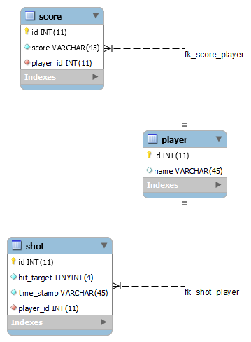

# Database

## ERD Diagram
Below the ERD is shown. This concept allows the system to be able to store player data. Using this data a table to see all the highscores is made possible. This allows an easy way of storing all the highscores with their 

  

## EER Diagram
To realise the previous established ERD this EER diagram was generated from the made tables this shows the different types of data that will be stored and the relation between the tables.

  

